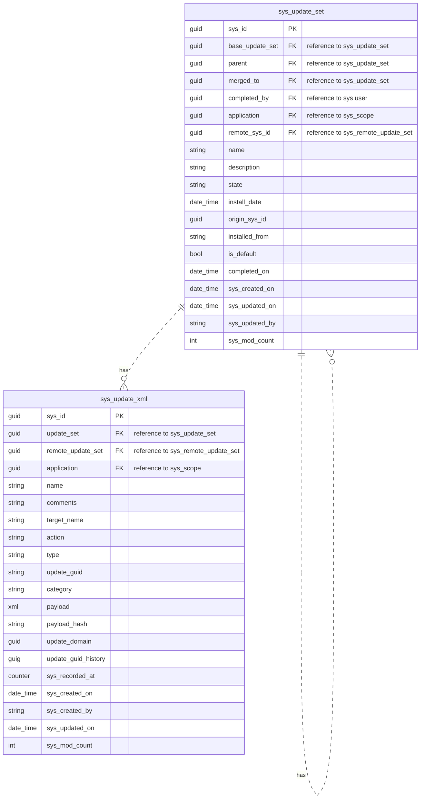
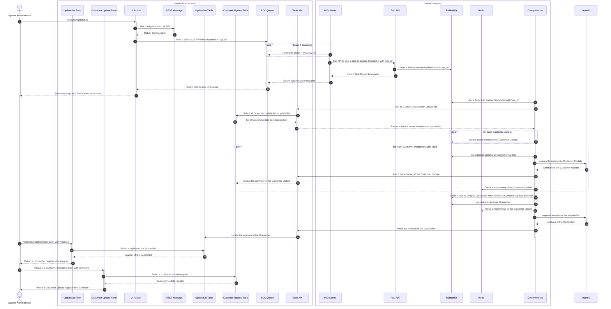

# UpdateSet Analyser

## Description

This project is a tool for analyzing UpdateSets of a *ServiceNow* instance through Generative AI. Its objective is to enable administrators of a *ServiceNow* instance to quickly evaluate changes by summarizing the *UpdateSets* and the *Customer Updates* that compose them.

## Technologies

### ServiceNow

ServiceNow is a cloud-based platform that provides a suite of applications to automate and manage IT service operations. It is designed to help organizations improve their IT service management processes and deliver better services to their customers. ServiceNow is used by organizations of all sizes to manage their IT infrastructure, applications, and services.

For more information about ServiceNow, see the [ServiceNow documentation](https://www.servicenow.com/).

#### ServiceNow UpdateSets

An *UpdateSet* is a group of changes that can be moved from one instance to another. It is a collection of configuration changes that can be moved from one instance to another. *UpdateSets* are used to group a series of changes that are related to a particular task or release. They are used to move configuration changes between instances.

Like everything in a ServiceNow instance, UpdateSets are stored in a table structure represented below:


Describing this data structure a little, we have the **Update Set** entity (physical name: `sys_update_set`) that groups a set of developed configurations that are stored in the **Customer Update** entity (physical name: `sys_update_xml`). An **Update Set** can also be composed of a set of child **Update Sets**, thanks to the self-realization that exists in the **Update Set** entity.

> **IMPORTANT**: For this application, only the simplest and most common case was taken into account, in which a record in the Update Set entity represents only one set of Customer Updates.

For more information about Update Sets, see the [ServiceNow documentation](https://www.servicenow.com/docs/bundle/xanadu-application-development/page/build/system-update-sets/concept/system-update-sets.html).


#### ServiceNow TableAPI

The TableAPI is a REST API that allows you to interact with the tables in a ServiceNow instance. It provides a simple and secure way to read, create, update, and delete records in your instance. The TableAPI is based on the REST principles and is designed to be easy to use and understand.

For more information about TableAPI, see the [ServiceNow documentation](https://www.servicenow.com/docs/bundle/xanadu-api-reference/page/integrate/inbound-rest/concept/c_TableAPI.html).

### OpenAI

OpenAI is an artificial intelligence research laboratory consisting of the for-profit OpenAI LP and the non-profit OpenAI Inc. The company aims to ensure that artificial general intelligence benefits all of humanity. The organization was founded in December 2015 by Elon Musk, Sam Altman, Greg Brockman, Ilya Sutskever, John Schulman, and Wojcie

For more information about OpenAI, see the [OpenAI documentation](https://www.openai.com/).

### FastAPI

FastAPI is a modern, fast (high-performance), web framework for building APIs with Python 3.6+ based on standard Python type hints. It is designed to be easy to use and understand, and it provides a simple and secure way to create APIs.

For more information about FastAPI, see the [FastAPI documentation](https://fastapi.tiangolo.com/).

### Celery

Celery is an asynchronous task queue/job queue based on distributed message passing. It is focused on real-time operation, but supports scheduling as well. It can be used to execute tasks in the background, such as sending emails, processing images, and other long-running tasks.

For more information about Celery, see the [Celery documentation](https://docs.celeryproject.org/en/stable/).

## Architecture

The UpdateSet Analyser application is composed of several components that work together to analyze UpdateSets of a ServiceNow instance through Generative AI. The main components of the application are:

- **ServiceNow Instance**: The ServiceNow instance is the source of the UpdateSets that will be analyzed. It contains the configuration changes that need to be analyzed.

- **Docker Compose**: The Docker Compose is used to run the application in a containerized environment. It provides a simple and secure way to deploy the application.

- **MID Server**: The MID Server is a Java application that runs as a Windows service or UNIX daemon on a server. It is used to connect to instances and execute automation tasks. The MID Server is used to connect to the ServiceNow instance and retrieve the UpdateSets that need to be analyzed.

- **FastAPI**: FastAPI is a modern, fast (high-performance), web framework for building APIs with Python 3.6+ based on standard Python type hints. It is used to create the API that will be used to analyze the UpdateSets.

- **RabbitMQ**: RabbitMQ is a message broker that is used to send messages between the components of the application. It is used to send messages between the MID Server and the FastAPI.

- **Redis**: Redis is an in-memory data structure store that is used as a cache to store the summaries of the Customer Updates. It is used to store the summaries of the Customer Updates that are retrieved from the OpenAI API.

- **Celery**: Celery is an asynchronous task queue/job queue based on distributed message passing. It is used to execute the tasks that analyze the UpdateSets and the Customer Updates.

## Sequence Diagram



## Requirements

To run the UpdateSet Analyser application, you need to have the following software installed on your machine:

- **Docker**: Docker is a platform that allows you to develop, ship, and run applications in containers. It provides a simple and secure way to deploy applications. For more information about Docker, see the [Docker documentation](https://docs.docker.com/).

- **Docker Compose**: Docker Compose is a tool that allows you to define and run multi-container Docker applications. It provides a simple and secure way to deploy multi-container applications. For more information about Docker Compose, see the [Docker Compose documentation](https://docs.docker.com/compose/).

- **Python**: Python is a programming language that is used to develop the UpdateSet Analyser application. It is a high-level, interpreted, and general-purpose programming language. For more information about Python, see the [Python documentation](https://www.python.org/).

- **Poetry**: Poetry is a tool that allows you to manage dependencies and create virtual environments for Python projects. It provides a simple and secure way to manage dependencies. For more information about Poetry, see the [Poetry documentation](https://python-poetry.org/).

In addition to these installed software, it is also necessary to:

- **ServiceNow Instance**: You need to have a ServiceNow instance to connect to the UpdateSet Analyser application. ServiceNow enables the creation of a Personal Developer Instance (PDI). To create a PDI, see the [ServiceNow documentation](https://developer.servicenow.com/dev.do#!/learn/learning-plans/washingtondc/new_to_servicenow/app_store_learnv2_buildmyfirstapp_washingtondc_personal_developer_instances).

- **OpenAI API Key**: You need to have an OpenAI API key to use the OpenAI API. OpenAI provides an API key that allows you to access the OpenAI API. To get an API key, see the [OpenAI documentation](https://platform.openai.com/docs/overview).

## Project Structure

The UpdateSet Analyser application is organized into several directories that contain the source code and configuration files of the application. The main directories of the application are:

- **mid-server**: The `mid-server` directory contains the MID Server installation files and the configuration files used in the MID Server instance to run in a docker container. For more information about the MID Server, see the [MID Server documentation](mid-server/README.md).

- **service-now-codes**: The `service-now-codes` directory contains the ServiceNow configuration files that can be imported into the instance that will be used. It also contains scripts that can be useful. For more information about the ServiceNow codes, see the [ServiceNow codes documentation](service-now-codes/README.md).

- **updateset_analyser**: The `updateset_analyser` directory contains the source code of the UpdateSet Analyser application. 

- **tests**: The `tests` directory contains the tests of the UpdateSet Analyser application. **`IN PROGRESS`**

In addition to these directories, the following files are also important:

- **docker-compose.yml**: The `docker-compose.yml` file is used to define the services that will be run in the Docker Compose environment. It contains the configuration of the services that will be run in the containerized environment.

- **Dockerfile**: The `Dockerfile` file is used to define the image that will be built in the Docker Compose environment. It contains the configuration of the image that will be built in the containerized the UpdateSet Analyser application.

- **entrypoint.sh**: The `entrypoint.sh` file is used to define the entry point of the UpdateSet Analyser application. It contains the logic of the entry point of the UpdateSet Analyser application.

## Environment Variables

The UpdateSet Analyser application uses environment variables to configure the application. The environment variables are used to define the configuration of the application, such as the ServiceNow instance URL, the OpenAI API key, and the RabbitMQ URL.

For this variables, you need to create a `.env` file in the updateset_analyser path with the following content:

```env
UPDATESET_ANALYSER_SERVICE_NOW_USER={{YOUR_SERVICE_NOW_USER}}
UPDATESET_ANALYSER_SERVICE_NOW_PASSWORD={{YOUR_SERVICE_NOW_PASSWORD}}
UPDATESET_ANALYSER_SERVICE_NOW_URL={{YOUR_SERVICE_NOW_URL}}
UPDATESET_ANALYSER_CELERY_BROKER_HOST=rabbitmq
UPDATESET_ANALYSER_CELERY_BROKER_PORT=5672
UPDATESET_ANALYSER_CELERY_BROKER_USER=user
UPDATESET_ANALYSER_CELERY_BROKER_PASSWORD=password
UPDATESET_ANALYSER_OPENAI_API_KEY={{YOUR_OPENAI_API_KEY}}
UPDATESET_ANALYSER_REDIS_HOST=redis
UPDATESET_ANALYSER_REDIS_PORT=6379
```

## Running the Application

To run the UpdateSet Analyser application, you need to follow the steps below:

1. Clone the repository:

```bash
git clone https://github.com/fgmira/updateset_analyser.git
```

2. Change to the `updateset_analyser` directory:

```bash
cd updateset_analyser
```

3. Create a `.env` file with the environment variables in the `updateset_analyser` directory:

```bash
echo "UPDATESET_ANALYSER_SERVICE_NOW_USER={{YOUR_SERVICE_NOW_USER}}" >> .env
echo "UPDATESET_ANALYSER_SERVICE_NOW_PASSWORD={{YOUR_SERVICE_NOW_PASSWORD}}" >> .env
echo "UPDATESET_ANALYSER_SERVICE_NOW_URL={{YOUR_SERVICE_NOW_URL}}" >> .env
echo "UPDATESET_ANALYSER_CELERY_BROKER_HOST=rabbitmq" >> .env
echo "UPDATESET_ANALYSER_CELERY_BROKER_PORT=5672" >> .env
echo "UPDATESET_ANALYSER_CELERY_BROKER_USER=user" >> .env
echo "UPDATESET_ANALYSER_CELERY_BROKER_PASSWORD=password" >> .env
echo "UPDATESET_ANALYSER_OPENAI_API_KEY={{YOUR_OPENAI_API_KEY}}" >> .env
echo "UPDATESET_ANALYSER_REDIS_HOST=redis" >> .env
echo "UPDATESET_ANALYSER_REDIS_PORT=6379" >> .env
```
> **IMPORTANT**: Before running docker compose, create the MidServer configuration files. To do this, follow the steps in the [MidServer documentation](mid-server/README.md).

4. Run the UpdateSet Analyser application using Docker Compose:

```bash
docker-compose up --build
```

5. Access the **FastAPI** application in your browser:

```text
http://localhost:8000/docs
```

6. Access the **Flower** application in your browser:

```text
http://localhost:5555
```

7. Access the **RabbitMQ** application in your browser:

```text
http://localhost:15672
```

### Preparing the ServiceNow Instance

To prepare the ServiceNow instance to be used with the UpdateSet Analyser application, you need to follow the steps below:

1. Import the `sys_rest_message_65ae7785c3fe9210907a9a2ed40131f8.xml`, `sys_rest_message_fn_86debb45c3fe9210907a9a2ed4013153.xml` and `sys_ui_action_5e4c9ae5c3be1610907a9a2ed40131a3.xml` file into the ServiceNow instance. These files contain the configuration of the REST messages and UI actions that will be used by the UpdateSet Analyser application. To learn how to perform this step, visit the [ServiceNow documentation](https://www.servicenow.com/docs/bundle/vancouver-platform-administration/page/administer/development-best-practices/task/t_ImportARecordAsXMLData.html).

2. Validate the MID Server. To learn how to perform this step, visit the [ServiceNow documentation](https://www.servicenow.com/docs/bundle/xanadu-servicenow-platform/page/product/mid-server/task/t_ValidateAMIDServer.html).


## Usage

To use the UpdateSet Analyser application, you need to follow the steps below:

1. Access the **ServiceNow** instance and select **Local Update Sets** in the **System Update Sets** module.

2. Create a custom updates in your **UpdateSet** if your instance doesn't have any, and create any **Customer Updates** that you want to analyze.

3. Access the **UpdateSet** record that you want to analyze and click on the **Analyze UpdateSet** UI action.

4. Wait for the analysis to be completed. You can check the status of the analysis in the **Flower** application.

5. Access the **UpdateSet** record that you analyzed and check the analysis in the **Description** field.

6. Access the **Customer Update** record that you analyzed and check the summary in the **Comments** field.

## License

This project is licensed under the **BEER-WARE LICENSE** - see the [LICENSE](LICENSE) file for details.
